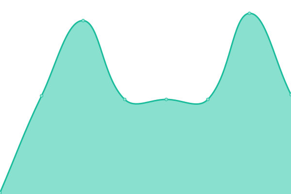

# [📈 Live Status](https://massalabs.github.io/website-status): <!--live status--> **🟩 All systems operational**

This repository contains the open-source uptime monitor and status page for [Massa](https://massa.net/), powered by [Upptime](https://github.com/upptime/upptime).

With [Upptime](https://upptime.js.org), you can get your own unlimited and free uptime monitor and status page, powered entirely by a GitHub repository. We use [Issues](https://github.com/massalabs/website-status/issues) as incident reports, [Actions](https://github.com/massalabs/website-status/actions) as uptime monitors, and [Pages](https://massalabs.github.io/website-status) for the status page.

<!--start: status pages-->
<!-- This summary is generated by Upptime (https://github.com/upptime/upptime) -->
<!-- Do not edit this manually, your changes will be overwritten -->
<!-- prettier-ignore -->
| URL | Status | History | Response Time | Uptime |
| --- | ------ | ------- | ------------- | ------ |
|  [Massa](https://massa.net/) | 🟩 Up | [massa.yml](https://github.com/massalabs/website-status/commits/HEAD/history/massa.yml) | 

 473ms
     
 | 

<a href="https://massalabs.github.io/website-status/history/massa">0.00%</a>
    

|  [TestNet v12.2](https://inno.massa.net/test12) | 🟩 Up | [test-net-v12-2.yml](https://github.com/massalabs/website-status/commits/HEAD/history/test-net-v12-2.yml) | 

 462ms
     
 | 

<a href="https://massalabs.github.io/website-status/history/test-net-v12-2">0.00%</a>
    

|  [TestNet v13 with U32](https://inno.massa.net/test13) | 🟩 Up | [test-net-v13-with-u32.yml](https://github.com/massalabs/website-status/commits/HEAD/history/test-net-v13-with-u32.yml) | 

 103ms
     
 | 

<a href="https://massalabs.github.io/website-status/history/test-net-v13-with-u32">0.00%</a>
    

|  [Flappy on InnoNet v12.2](https://37.187.156.118/thyra/browse/A1PBsdX7sZA1kdSzcFzRT3JbSm3cjrxpfcJNNo9YaMZNGuZE3ec/index.html) | 🟩 Up | [flappy-on-inno-net-v12-2.yml](https://github.com/massalabs/website-status/commits/HEAD/history/flappy-on-inno-net-v12-2.yml) | 

 348ms
     
 | 

<a href="https://massalabs.github.io/website-status/history/flappy-on-inno-net-v12-2">0.00%</a>
    

<!--end: status pages-->

[**Visit our status website →**](https://massalabs.github.io/website-status)

## 📄 License

- Powered by: [Upptime](https://github.com/upptime/upptime)
- Code: [MIT](./LICENSE) © [Massa](https://massa.net/)
- Data in the `./history` directory: [Open Database License](https://opendatacommons.org/licenses/odbl/1-0/)
